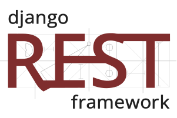

## Intro

#### A full-time full-stack Web Developer 👨‍💻 working remotely 🚀

- 🎓 Bachelor in Information Systems from UFRN.
- 🤔 Exploring new technologies and developing software solutions.

### Connect with me

  
  
  

  

<table>
  <th>
    <h3>Developer</h3>
  </th>
  <th>
    <h3>GitHub Stats</h3>
  </th>
  <tr>
    <td width="50%">
      <h3>Frontend</h3>
      

        ⠀
        ⠀
        
        
        
      

      <h3>Backend</h3>
      

        
        ⠀
        <a href="https://www.django-rest-framework.org" target="_blank" rel="noreferrer" style="text-decoration: none">
          <picture>
            <source media="(prefers-color-scheme: dark)" srcset="./assets/backend/django-rest-light.svg">
            <source media="(prefers-color-scheme: light)" srcset="./assets/backend/django-rest-dark.svg">
            
          </picture>
        </a>⠀
        <a href="https://flask.palletsprojects.com/" target="_blank" rel="noreferrer" style="text-decoration: none">
          <picture>
            <source media="(prefers-color-scheme: dark)" srcset="./assets/backend/flask-light.svg">
            <source media="(prefers-color-scheme: light)" srcset="./assets/backend/flask-dark.svg">
            
          </picture>
        </a>⠀
        <a href="https://www.postgresql.org/" target="_blank" rel="noreferrer" style="text-decoration: none">
          <picture>
            <source media="(prefers-color-scheme: dark)" srcset="./assets/backend/postgresql-light.svg">
            <source media="(prefers-color-scheme: light)" srcset="./assets/backend/postgresql-dark.svg">
            
          </picture>
        </a>⠀
        ⠀
      

      <h3>Cloud & DevOps</h3>
      

        
        
        <a href="https://github.com/" target="_blank" rel="noreferrer" style="text-decoration: none">
          <picture>
            <source media="(prefers-color-scheme: dark)" srcset="./assets/cloud_devops/github-light.svg">
            <source media="(prefers-color-scheme: light)" srcset="./assets/cloud_devops/github-dark.svg">
            
          </picture>
        </a>
        <a href="https://aws.amazon.com/" target="_blank" rel="noreferrer" style="text-decoration: none">
          <picture>
            <source media="(prefers-color-scheme: dark)" srcset="./assets/cloud_devops/aws-light.svg">
            <source media="(prefers-color-scheme: light)" srcset="./assets/cloud_devops/aws-dark.svg">
            
          </picture>
        </a>
      

      <h3>Tools and Applications</h3>
      

        
        
        
        
      

        
    </td>
    <td width="50%">
      

        
      

      

        
      

      

        
      

    </td>
  </tr>
</table>
